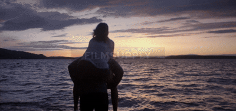

<p align="left">
  
  
  
</p>

# RAGDiffusion

This project implements a diffusion model for video-to-video generation, specifically for the task of generating videos from text prompts. The model is based on the diffusion model "SD Turbo", **the principal idea is to use a previous generated frame of the video blended with the current frame to generate the next frame**. This method allows for a more coherent and consistent video generation process, as the model can leverage the information from the previous frame to generate the next one.


## Installation
```bash
git clone https://github.com/jbaudru/RAGDiffusion.git 
cd RAGDiffusion
pip install -r requirements.txt
```


## Usage
```bash
python main.py --prompt "A cat playing with a ball" --video_path "test.mov" --output_name "resutl" --fps 10 --num_inference_steps 4 --strength 0.75 --guidance_scale 7.5 --blend 0.3
```

## Parameters
- `--prompt`: The text prompt to guide the image generation process (default: `"Dali painting, surrealism, abstract"`).
- `--video_path`: Path to the input video file (default: `"input/video.mov"`).
- `--output_name`: Name of the output video without extension (default: `"results_strong_original"`).
- `--fps`: Frames per second for the output video (default: `24`).
- `--num_inference_steps`: Number of inference steps for frame generation (default: `2`).
- `--strength`: Strength of the diffusion effect (0 = Original video, 1 = Fully generated) (default: `0.25`).
- `--guidance_scale`: Guidance scale for video generation - lower values (<7.5) provide more creative freedom, higher values (>7.5) enforce stricter adherence to the prompt (default: `7.5`).
- `--blend`: Blending factor for mixing the current frame with the previous generated frame (default: `0.45`).


## Example

### Original Video


### 0% Blend (No RAG)


### 40% Blend


## TODO
- Allow to use multiple prompts for the output video.
- Allow to use mutiple previous frames to generate the next frame.
- Fix progress bar bug.
- Speed up the generation process.