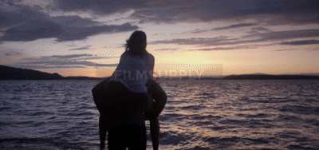

# RAGDiffusion - Enhanced with Text-to-Video Generation

<p align="left">
  
  
  
</p>

This project implements a diffusion model for **video-to-video** and **text-to-video** generation. The model supports two main modes:

1. **Video-to-Video Generation**: Transform existing videos using text prompts (original functionality)
2. **Text-to-Video Generation**: Create videos from scratch using only text prompts (**NEW!**)

The principal idea is to use a previous generated frame of the video blended with the current frame to generate the next frame. This method allows for a more coherent and consistent video generation process.

## 🚀 New Features

- **Text-to-Video Generation**: Generate videos without requiring input video
- **Flexible Input**: Works with or without input video
- **Time-based Prompts**: Support for SRT files and text files with time-specific prompts
- **Customizable Output**: Control video dimensions, duration, and quality

## Installation
```bash
git clone https://github.com/jbaudru/RAGDiffusion.git 
cd RAGDiffusion
pip install -r requirements.txt
```

## Usage

### 1. Text-to-Video Generation (New!)
Generate a video from text prompts only:
```bash
python genVideo.py --prompt "a magical forest with glowing mushrooms, mystical atmosphere" --duration 8.0 --fps 12 --width 512 --height 512 --output_name "magical_forest"
```

### 2. Video-to-Video Generation (Original)
Transform an existing video using text prompts:
```bash
python genVideo.py --prompt "cyberpunk style, neon lights" --video_path "input/dance.mp4" --output_name "cyberpunk_dance" --strength 0.4
```

### 3. Using Prompt Files
Use time-based prompts from a file:
```bash
python genVideo.py --prompt_file "prompts.txt" --duration 10.0 --output_name "sequence_video"
```

### 4. Run Examples
Try the example script to see different usage modes:
```bash
python example_text_to_video.py
```

## Parameters

### Core Parameters
- `--prompt`: Text prompt to guide the generation (default: artistic scene description)
- `--negative_prompt`: What to avoid in generation (default: quality issues)
- `--video_path`: Input video file path (optional - if not provided, generates from text only)
- `--output_name`: Output video name without extension (default: "output_video/generated_video")

### Video Generation Settings
- `--fps`: Frames per second (default: 15)
- `--duration`: Video duration in seconds (default: 5.0, only used for text-to-video)
- `--width`: Frame width (default: 512, only used for text-to-video)
- `--height`: Frame height (default: 512, only used for text-to-video)

### Quality Settings
- `--num_inference_steps`: Inference steps per frame (default: 10)
- `--strength`: Transformation strength for input video (0=original, 1=fully generated, default: 0.35)
- `--guidance_scale`: Prompt adherence (<7.5=creative, >7.5=strict, default: 7.5)

### Frame Continuity
- `--blend`: Previous frame influence (default: 0.1)
- `--num_previous_frames`: Number of previous frames to blend (default: 1)
- `--seed`: Random seed for reproducibility (default: 66)

### Advanced Features
- `--prompt_file`: Path to .txt or .srt file with time-based prompts

## Prompt File Formats

### Text File (.txt)
Simple text prompt that applies to the entire video:
```
a serene landscape with rolling hills and a sunset sky
```

### SRT File (.srt)
Time-based prompts for different video segments:
```
1
00:00:00,000 --> 00:00:03,000
a peaceful morning scene with birds singing

2
00:00:03,000 --> 00:00:06,000
the sun rising over mountains with golden light

3
00:00:06,000 --> 00:00:10,000
a flowing river through a green valley
```

You can generate SRT files using: [Clideo SRT File Generator](https://clideo.com/create-srt-file)

## Runtime Performance
For **stabilityai/sd-turbo** model:
| GPU | Mode | num_inference_steps | strength | guidance_scale | blend | runtime(s)/frame |
|-----|------|---------------------|----------|----------------|-------|-------------|
| RTX 3090 | Video-to-Video | 10 | 0.25 | 7.5 | 0.15 | 2.16s |
| RTX 3090 | Video-to-Video | 15 | 0.25 | 7.5 | 0.15 | 2.57s |
| RTX 3090 | Text-to-Video | 10 | N/A | 7.5 | 0.15 | ~2.5s |
| RTX 3090 | Text-to-Video | 15 | N/A | 7.5 | 0.15 | ~3.2s |

## Usage Examples

### Basic Text-to-Video
```bash
# Generate a 5-second nature video
python genVideo.py \
  --prompt "beautiful sunset over ocean waves, peaceful seascape" \
  --duration 5.0 \
  --fps 15 \
  --output_name "sunset_ocean"
```

### High-Quality Text-to-Video
```bash
# Generate a detailed fantasy scene
python genVideo.py \
  --prompt "enchanted forest with magical creatures, fantasy art style, detailed" \
  --negative_prompt "low quality, blurry, distorted, ugly" \
  --duration 8.0 \
  --fps 12 \
  --width 768 \
  --height 768 \
  --num_inference_steps 20 \
  --guidance_scale 8.5 \
  --blend 0.2 \
  --output_name "enchanted_forest_hq"
```

### Video Transformation with Strong Effect
```bash
# Transform existing video with artistic style
python genVideo.py \
  --prompt "oil painting style, impressionist art, warm colors" \
  --video_path "input/original.mp4" \
  --strength 0.6 \
  --blend 0.3 \
  --output_name "artistic_transformation"
```

## Example Outputs

### Original Video


### 0% Blend (No RAG)

<sub>**Parameters**: fps:24, num_inference_steps:10, strength:0.35, guidance_scale:7.5, blend:0</sub>

### 15% Blend (RAG)

<sub>**Parameters**: fps:24, num_inference_steps:10, strength:0.35, guidance_scale:7.5, blend:0.15</sub>

### Text-to-Video Generation (New!)
*Coming soon: Examples of pure text-to-video generation*

## TODO
- [x] Text-to-video generation without input video requirement
- [x] Support for custom video dimensions and duration
- [x] Enhanced prompt file support
- [ ] Keep sound of original video and add it to the generated video
- [ ] Speed up the generation process
- [ ] Support for longer video sequences
- [ ] Better temporal consistency for text-to-video mode

## Contributing
Contributions are welcome! Please feel free to submit a Pull Request.

## License
This project is licensed under the MIT License - see the LICENSE file for details.
